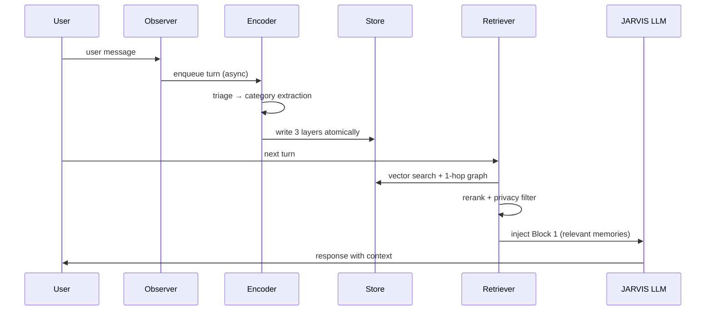
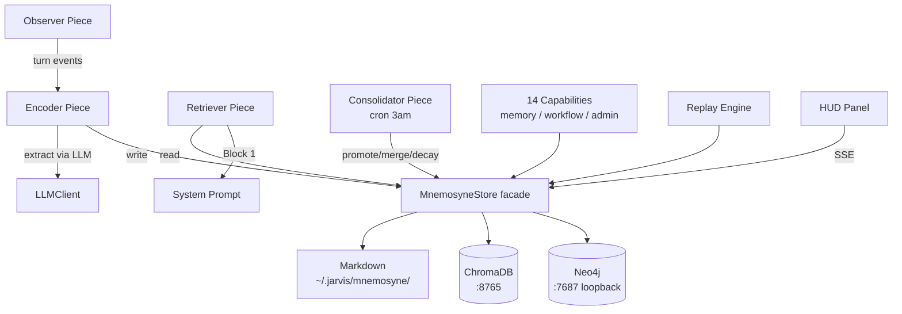

# jarvis-plugin-mnemosyne

> Long-term memory for JARVIS — modeled on brain memory consolidation.
> Hybrid storage (Markdown + ChromaDB + Neo4j) + two-pass extraction +
> hybrid retrieval + nightly consolidation.

---

## What it does

Mnemosyne gives JARVIS persistent memory across sessions. Every user turn is
observed; an LLM-driven encoder extracts structured knowledge (code patterns,
preferences, mental models, architecture decisions, anti-patterns, workflows,
glossary terms) and writes it to a three-layer hybrid store. On the next
turn, a retriever pulls the most relevant memories — vector-similar plus
graph-related — reranks them, and injects a compact summary into the system
prompt so JARVIS responds with full context.



---

## Quick start

### Prerequisites
- **Docker** (for Neo4j container, loopback-only)
- **Python 3.10+** with `chromadb` package on PATH
- **Node 20+** (matches JARVIS runtime)

### Install
```bash
# From within JARVIS
plugin_install github.com/giovanibarili/jarvis-plugin-mnemosyne

# or clone manually
git clone https://github.com/giovanibarili/jarvis-plugin-mnemosyne ~/.jarvis/plugins/jarvis-plugin-mnemosyne
```

The plugin auto-runs `scripts/preflight-check.sh` on startup. Failures
surface as a red **Preflight Error** panel in the HUD with actionable hints
(missing Python, port conflict on 7687/8765, Docker not running, etc.).

### Verify install
Run scenarios from [`functional-test.md`](./functional-test.md) — 19 BDD
scenarios cover boot, encoding, retrieval, consolidation, decay, conflict
detection, privacy, workflow replay, and the D2 system-prompt invariant.

---

## Architecture



### Storage layer breakdown
- **Markdown** at `~/.jarvis/mnemosyne/short/<category>/<slug>.md` and
  `long/<category>/<slug>.md` — canonical, human-readable,
  git-version-controllable. Source of truth for rebuild.
- **ChromaDB** on port `8765` (auto-spawned local server, MiniLM embeddings)
  — semantic vector search.
- **Neo4j** on port `7687` (Docker container `mnemosyne-neo4j`, no-auth,
  bound to `127.0.0.1` only — see [D10](#privacy--security)) — entity
  relationships, workflow graphs (Workflow → Step nodes via NEXT edges).

### Pipeline
1. **Extract** — Observer queues turns; Encoder triages then runs
   category-specific extraction prompts (two-pass with confidence floor).
2. **Store** — MnemosyneStore writes atomically to all three layers; failure
   in any layer rolls back.
3. **Retrieve** — Vector top-k + 1-hop graph expansion → Reranker
   (recency/confidence/reinforcements/graph-distance) → privacy filter →
   ephemeral context injection (see [Injection architecture](#injection-architecture)).
4. **Consolidate** — Nightly cron (3am): promote short→long on threshold,
   merge near-duplicates, detect conflicts via judge LLM, apply decay.
5. **Replay** — Workflow replays load Step graph and execute with
   per-step confirmation.

### Injection architecture

Memories are injected as an **ephemeral user-message block** (`cache_control: ephemeral`)
prepended to the user's prompt — not in the system prompt. This preserves Anthropic prompt
cache across turns (the stable system prompt never mutates) while still grounding every
response with the most relevant context.

**Two-phase async injection (since v1.1):**

```
ai.request received
  → Retriever subscriber: lastUserMsg[sid] = text
                          pendingFetch[sid]  = systemContext(sid)   ← async DB fetch starts

sendAndStream called
  → await contextInjector(sid)
      → injector awaits pendingFetch[sid] with 800ms safety timeout
      → cache populated → returns [<system-reminder>…</system-reminder>]
  → memoryBlock prepended to user message as ephemeral block
  → API call
```

**Deduplication:** the injector tracks `lastInjectedBlock` per session. If the retrieved
block is identical to the previous turn's block, injection is skipped entirely (the model
already has it in context from the previous turn). Re-injection happens when memories change
or after compaction (which wipes context history).

**Actor sessions:** `actor-runner` publishes `ai.request` before calling `sendAndStream` so
the retriever's subscriber primes `pendingFetch` before the injector runs.

**Core changes required:** `ContextInjectorFn` in `@jarvis/core` returns
`Promise<string[]>`, `sendAndStream` awaits it, and the PluginManager aggregator uses
`Promise.allSettled` to await injectors in parallel.

### Bus channels
- `mnemosyne.observation` — raw turn events from Observer to Encoder
- `mnemosyne.extracted` — extraction results (category + confidence + body)
- `mnemosyne.write` — store mutations (used to refresh HUD panel via SSE)
- `mnemosyne.retrieval` — retrieval requests/responses (used by `memory_explain`)
- `mnemosyne.consolidation` — start/finish/error events from the cron piece
- `hud.update` — panel state for `MnemosynePanel` and `PreflightErrorPanel`

Plugins or scripts wanting to observe Mnemosyne should subscribe to these
channels rather than poking the store directly.

---

## Configuration

Defaults live in [`config.default.json`](./config.default.json). Override per
install via `~/.jarvis/settings.user.json` under
`plugins.jarvis-plugin-mnemosyne`. Full spec in `config.default.json` (root of this repo).

Notable knobs:

| Path | Purpose | Default |
|---|---|---|
| `retriever.rerank_weights` | Score blend for retrieval ranking | recency 0.25 / confidence 0.30 / reinforcements 0.25 / graph 0.20 |
| `decay.score_threshold` | Below this, memory is forgotten on consolidation | `60` |
| `consolidator.conflict_similarity_threshold` | Cosine threshold to flag conflicts | `0.7` |
| `consolidator.promotion_threshold_reinforcements` | Reinforcements needed for short→long | `3` |
| `consolidator.cron` | Consolidation schedule (cron syntax) | `0 3 * * *` |
| `encoder.min_confidence` | Floor below which extracted memory is dropped | `0.6` |

---

## Tools (AI-callable capabilities)

### Memory management
| Tool | Description |
|---|---|
| `memory_search` | Hybrid vector+graph search with rerank, returns ranked results |
| `memory_get` | Fetch a single memory by id (full content + metadata) |
| `memory_list` | List memories filtered by category, layer, session, or pinned |
| `memory_update` | Edit content, category, or visibility of an existing memory |
| `memory_delete` | Remove a memory across all 3 layers atomically |
| `memory_pin` | Pin a memory (immune to decay/forgetting) |
| `memory_unpin` | Remove the pin flag |
| `memory_promote` | Force short→long promotion without waiting for consolidator |
| `memory_explain` | Show retrieval rationale: which signals fired, rerank breakdown |

### Workflow
| Tool | Description |
|---|---|
| `workflow_list` | List captured workflows by trigger / name |
| `workflow_get` | Fetch full workflow including ordered Step graph |
| `workflow_replay` | Execute a workflow step-by-step with per-step confirmation |

### Admin
| Tool | Description |
|---|---|
| `mnemosyne_consolidate` | Run the consolidator on demand (bypass cron) |
| `mnemosyne_stats` | Counts per layer/category, decay queue size, conflict count |

---

## Scripts (admin CLI)

Located in [`scripts/`](./scripts/). All run from plugin root.

| Script | When to use |
|---|---|
| `preflight-check.sh` | Diagnose boot failures; runs same checks as auto-preflight |
| `rebuild-indexes.ts` | Rebuild Chroma + Neo4j from canonical Markdown after corruption |
| `backup.sh` | Snapshot Markdown + Neo4j dump + Chroma export to a tarball |
| `restore.sh` | Restore from a backup tarball |
| `wipe-test-state.sh` | Reset all 3 layers (test/dev only — destructive) |
| `check-stats.ts` | Print per-layer counts and health summary |

---

## Privacy & security

- **D10 — Neo4j loopback only.** The Docker container binds Bolt (`7687`)
  and Browser (`7474`) to `127.0.0.1`. No-auth is acceptable because the
  port is unreachable from any network. Never expose to `0.0.0.0`.
- **D14 — Per-memory visibility.** Each memory has `visibility: open |
  private`. Private memories are session-locked and only retrievable by the
  originating session.
- **Privacy filter on retrieval.** Default policy
  `open_or_same_session` runs before rerank — private cross-session
  memories are dropped from candidates entirely, not just down-weighted.
- **Pinning.** Pinned memories are exempt from decay and from
  consolidator merge/forget passes.

---

## Development

### Project layout
```
lib/          ← core logic (adapters, store facade, extractor, retriever helpers, replay)
  tools/      ← capability tool definitions (14 tools across 4 files)
pieces/       ← JARVIS pieces (observer, encoder, retriever, consolidator, panel)
renderers/    ← HUD UI (MnemosynePanel, MemoryCard, PreflightErrorPanel, WorkflowReplayDialog)
prompts/      ← LLM extraction prompts (one per category + triage + conflict-judge)
scripts/      ← admin CLI (preflight, backup, restore, rebuild, wipe, stats)
cypher/       ← Neo4j schema + bootstrap queries
docker/       ← Neo4j compose stub
test/         ← vitest unit + integration suites
```

### Build & test
```bash
make install      # npm install with public registry override (see Makefile)
make typecheck    # tsc --noEmit
make test         # vitest run --no-file-parallelism
```

- **35 unit tests** passing (no external services required)
- **7 integration tests** require the Docker stack running — they exercise
  Chroma + Neo4j end-to-end. Use `scripts/wipe-test-state.sh` between runs.
- `--no-file-parallelism` is required: tests share Chroma/Neo4j ports and
  must serialize.

### Troubleshooting

| Symptom | First check |
|---|---|
| Red Preflight panel on boot | Run `scripts/preflight-check.sh` manually; output names the missing dependency |
| Port `7687` already in use | `docker ps` for stray `mnemosyne-neo4j`; or another Neo4j on the host. Loopback bind is mandatory — never change to `0.0.0.0` |
| Port `8765` already in use | Another Chroma server is running; stop it or change `chroma.port` in config |
| Memories not appearing in Block 1 | Check confidence (`mnemosyne_stats`); extraction may be dropping below `encoder.min_confidence` |
| Extraction silently empty | Tail `chroma.log`; verify Encoder LLM client is wired (see `pieces/index.ts`) |
| Index drift after manual MD edits | Run `scripts/rebuild-indexes.ts` — Markdown is the source of truth |

### Errata — required reading before extending

The original implementation plan had **34 errata entries** documenting plan-vs-reality
deviations (port choices, schema adjustments, prompt iterations, race fixes). Key
decisions are documented in code comments throughout `pieces/index.ts`,
`lib/extractor.ts`, and `lib/neo4j-adapter.ts`. Read the inline comments before
changing anything load-bearing — most "obvious" tweaks have already been tried and have
a recorded reason for landing where they did.

---

## Roadmap

Full version sequencing planned:

| Version | Focus |
|---|---|
| **v1.0** | Full-stack MVP — extract, store, retrieve, consolidate, replay |
| **v1.1 (current)** | Sync first-turn injection — pendingFetch pattern, async `ContextInjectorFn`, dedup by block hash, compaction reset. Multilingual encoding, origin tracking, injection dedup, query enrichment. |
| v1.2 | Anti-hallucination layer — provenance, citation enforcement |
| v1.3 | Query intelligence — semantic query rewrite, intent classification |
| v1.4 | Adaptive retrieval — learned rerank weights per query class |
| v1.5+ | Async hardening, reconsolidation surfacing, workflow learning |

---

## License

MIT — see [`plugin.json`](./plugin.json).

---

## Acknowledgments

- Inspired by neuroscience consolidation models (hippocampus → neocortex
  systems consolidation, sleep-driven replay).
- LuMay AI Modern RAG Pipeline blueprint — referenced for v1.2 query
  intelligence and v1.3 adaptive retrieval design.
- Built collaboratively by the JARVIS actor pool (8 workers, ~5000 lines,
  in 1 day).
